# AI Companion CMP

An AI-assisted travel planning demo built with Kotlin and Compose Multiplatform for Android and iOS. The project focuses on multi-step conversational flows, predictable UI state, recoverable LLM failures, and an Android-first shared architecture.

> This is a product and engineering prototype, not a complete OTA or transaction platform.

## Product Demo

Place media here, immediately after the project introduction. This is the highest-visibility position for interview reviewers.

<!-- TODO: Add a 30-60 second demo video link here. Recommended: YouTube or GitHub Release asset. -->
<!-- TODO: Add an Android/iOS side-by-side screenshot or an animated GIF here. -->

| Flow | What It Demonstrates |
| --- | --- |
| Create a companion and take the Travel DNA quiz | Forms, quiz state, and personalized results |
| Import an existing itinerary | Free-form text is sent to an AI summary service to infer destination and travel context |
| Refine preferences and generate a trip | Conversational questions, structured daily itineraries, and loading/failure states |
| Revise an itinerary with natural language | A requested change is applied as an itinerary patch without rebuilding the entire flow |
| Open external services | Maps and OTA search pages are launched through native platform capabilities |

## Problem And Scope

Travel planning is iterative. A user may start with an itinerary generated by ChatGPT, or only know a destination and a few preferences. This demo turns that uncertainty into a traceable flow: understand existing context, collect preferences, generate a daily itinerary, and revise it in place.

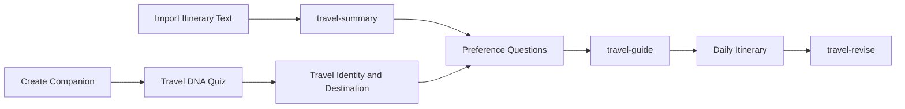

## Key Engineering Decisions

| Decision | Approach | Why It Matters |
| --- | --- | --- |
| Android-first, cross-platform delivery | Compose Multiplatform shares UI and business logic between Android and iOS | Preserves the Android Compose development model while reducing feature drift on iOS |
| MVVM | Screens observe immutable state from `AiCompanionViewModel` | Keeps business workflows out of Composables and makes loading, success, and retryable failure states explicit |
| Layered architecture | UI -> ViewModel -> UseCase -> Repository -> Remote/Local | Maintains a single dependency direction and makes UI, persistence, and API implementations replaceable |
| LLM soft failures | The API returns recoverable `fail_reason` responses instead of treating every failure as a 5xx | Preserves user context and offers a retry path instead of breaking the conversation |
| Platform boundary | `expect`/`actual` isolates browser launching, sharing, and native APIs | Shared UI does not need to know about Android intents or UIKit details |
| Scoped module topology | `androidApp`, `shared`, and `iosApp` establish clear delivery boundaries | Keeps a single-feature demo simple while preserving a path to feature modules |

## Architecture

### Module Topology

The project uses three module and host boundaries appropriate for a single-feature demo, rather than prematurely creating many Gradle modules.

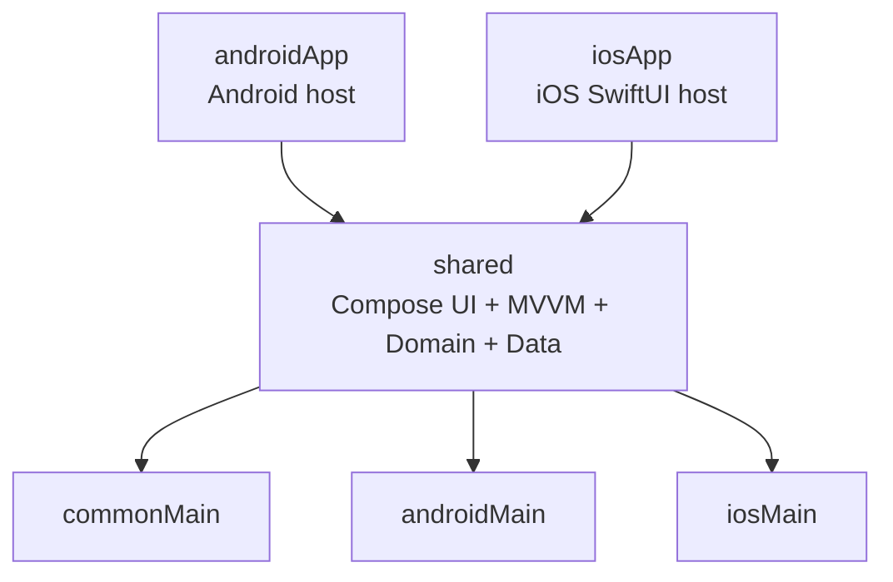

| Module | Responsibility |
| --- | --- |
| `androidApp` | Android application host, manifest, and packaging |
| `shared` | Compose UI, ViewModels, domain logic, repositories, networking, local storage, and shared resources |
| `iosApp` | SwiftUI application host, Xcode project, and framework embedding |
| `shared/commonMain` | Shared product behavior and abstractions |
| `shared/androidMain` | Android-specific implementations such as external URLs and system sharing |
| `shared/iosMain` | UIKit and Foundation interop for external URLs and system sharing |

This structure intentionally separates deliverable applications from reusable feature code. As the project grows, the existing `data`, `domain`, and `ui` boundaries can be extracted into `core:*` and `feature:*` modules without changing the presentation-to-data dependency direction.

### MVVM And Unidirectional Data Flow

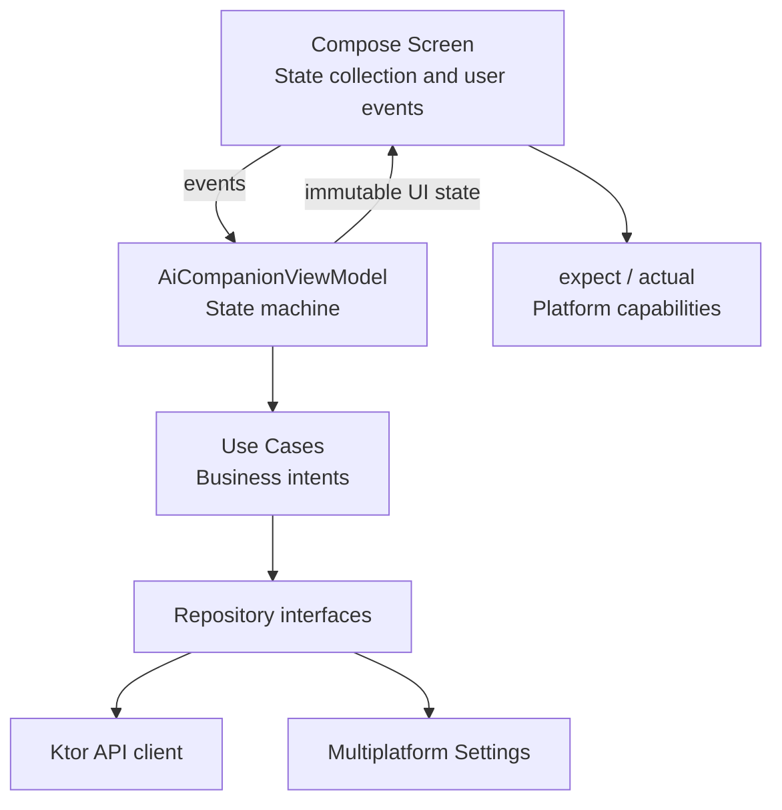

`AiCompanionViewModel` coordinates the flow by retaining conversation context, preference answers, the current summary, and itinerary state. Compose screens render state and dispatch events only. This follows Android's recommended unidirectional data flow and state-holder approach while keeping API callbacks out of Composables.

## AI Workflow And API Contract

| Endpoint | Responsibility | Client Behavior |
| --- | --- | --- |
| `POST /v1/plan/travel-summary` | Builds a travel summary from imported text or existing context | Shows the summary and keeps entry points for supplementary input and regeneration |
| `POST /v1/plan/recommend-city` | Narrows down an unknown destination through multiple turns | Retains conversation history and previously suggested cities to avoid repetition |
| `POST /v1/plan/travel-guide` | Generates a structured itinerary from a summary, city, and preferences | Shows loading, completion messages, or a retryable soft failure |
| `POST /v1/plan/travel-revise` | Applies a natural-language change to an existing itinerary | Updates the current itinerary with a patch instead of recreating the entire UI flow |

LLM responses are not treated as inherently reliable. The client distinguishes these states:

| State | Meaning | UI Response |
| --- | --- | --- |
| `Loading` | A request is in progress | Shows typing or loading feedback while preserving the existing conversation context |
| `Loaded` / `Ready` | Schema and business conditions are valid | Presents the next action or itinerary result |
| `SoftFailed` | HTTP succeeded but the response contains `fail_reason` | Shows the backend fallback message and a retry action |
| `InvalidRequest` | Request contract validation failed | Shows a non-retryable generic error to avoid resending the same invalid request |
| `Error` | Network or unexpected failure | Provides a recoverable retry action |

## Tech Stack

| Area | Technology |
| --- | --- |
| Language | Kotlin 2.4 |
| UI | Compose Multiplatform and Material 3 |
| Android | Android Gradle Plugin and a Compose host app |
| iOS | Kotlin/Native framework and a SwiftUI host app |
| Presentation | AndroidX ViewModel, Lifecycle state collection, and MVVM |
| Dependency injection | Koin |
| Networking | Ktor Client and kotlinx.serialization |
| Persistence | Multiplatform Settings |
| Images | Coil 3 |
| Platform integration | Kotlin `expect` / `actual`, UIKit, and Android Intent |

## Project Structure

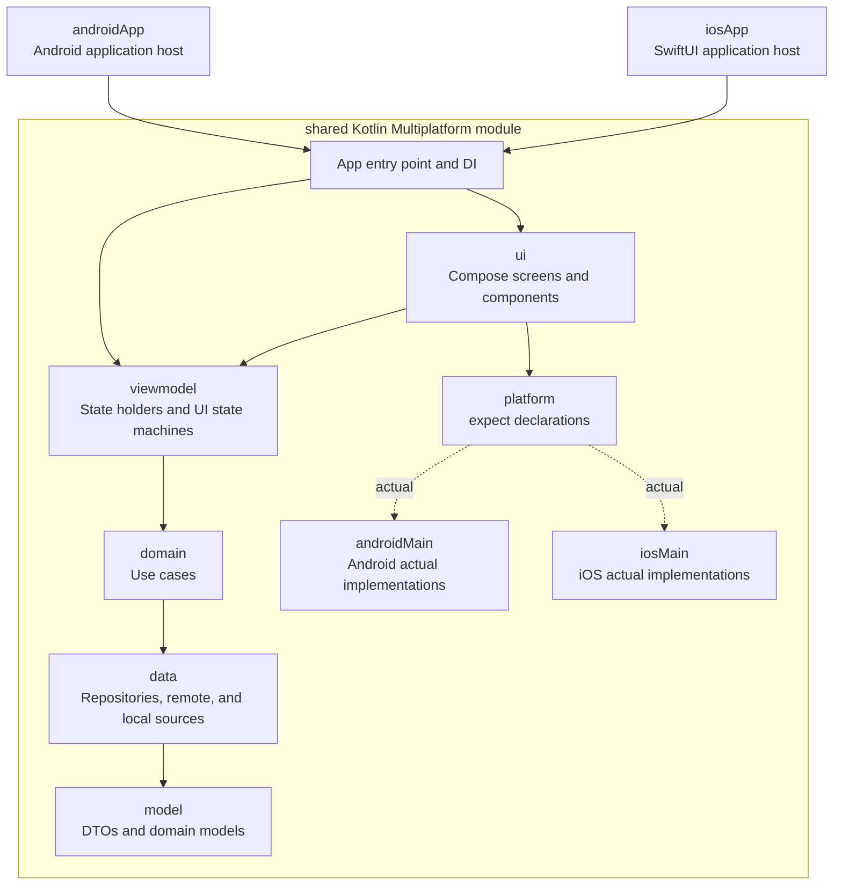

## Cross-Platform Details

| Concern | Android | iOS |
| --- | --- | --- |
| Open external URLs | `Intent.ACTION_VIEW` | `UIApplication.open(_:options:completionHandler:)` |
| Text and image sharing | Android share intent | `UIActivityViewController` |
| Image loading | Shared Coil UI API | Shared Coil UI API with Darwin networking |
| Keyboard interaction | Compose IME actions | Compose Done action and focus clearing for UIKit keyboard behavior |
| Local storage | Shared settings API | Shared settings API |

## Build And Run

### Prerequisites

- A JDK compatible with the Gradle wrapper
- Android Studio for Android development
- Xcode and an iOS Simulator for iOS development

### Android

```bash
./gradlew :androidApp:assembleDebug
```

### iOS

Open `iosApp/iosApp.xcodeproj` in Xcode, choose an arm64 simulator, and run the `iosApp` scheme.

Equivalent command-line verification:

```bash
xcodebuild \
  -project iosApp/iosApp.xcodeproj \
  -scheme iosApp \
  -configuration Debug \
  -sdk iphonesimulator \
  -destination 'platform=iOS Simulator,name=iPhone 17' \
  build
```

## Verification

| Scope | Command |
| --- | --- |
| Android package | `./gradlew :androidApp:assembleDebug` |
| Android host tests | `./gradlew :shared:testAndroidHostTest` |
| iOS simulator tests | `./gradlew :shared:iosSimulatorArm64Test` |
| iOS framework and host build | Use the `xcodebuild` command above |

## Known Limitations And Next Steps

- Image itinerary import requires a backend file-upload API; the current implementation supports text import.
- OTA links open external search pages and do not include live inventory, pricing, or checkout.
- The LLM backend should canonicalize city aliases and variants and validate its output schema.
- Future work includes ViewModel contract tests, Compose UI tests, observability events, and extracting the shared layers into smaller Gradle modules.

## Screenshots

| | |
| --- | --- |
| 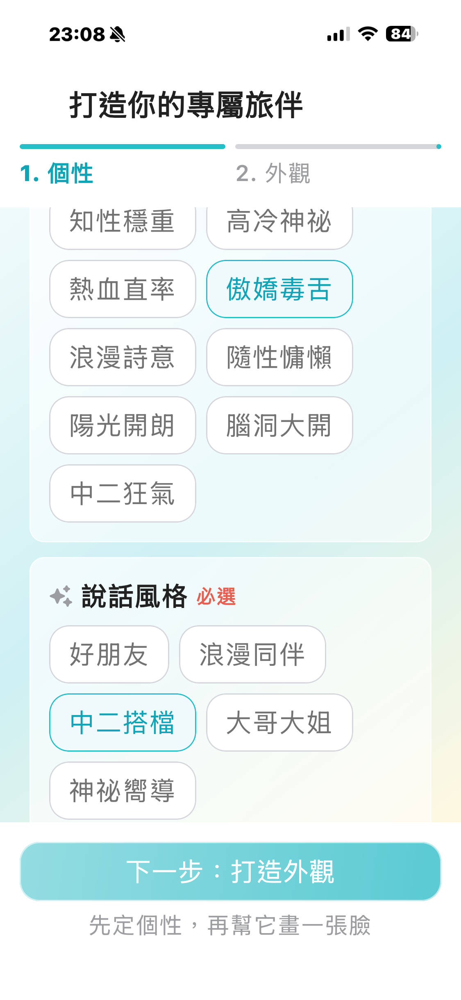 | 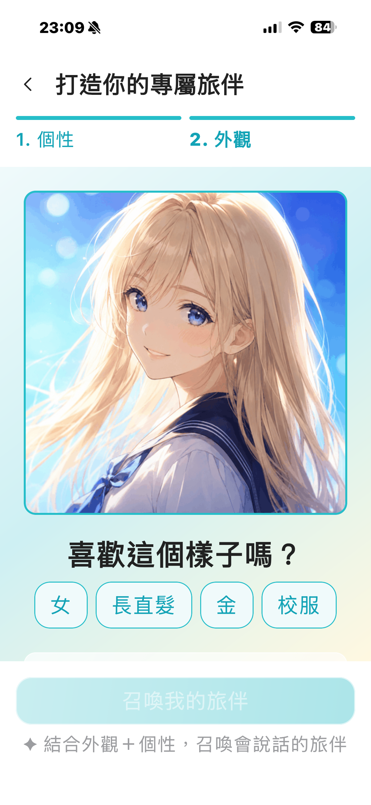 |
| 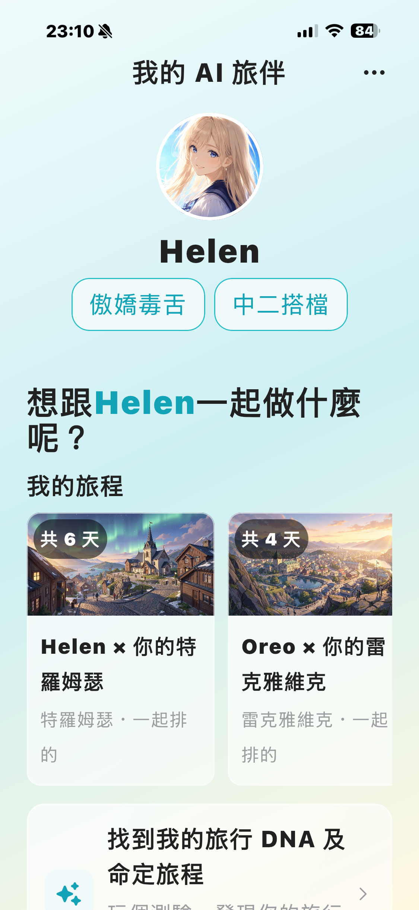 | 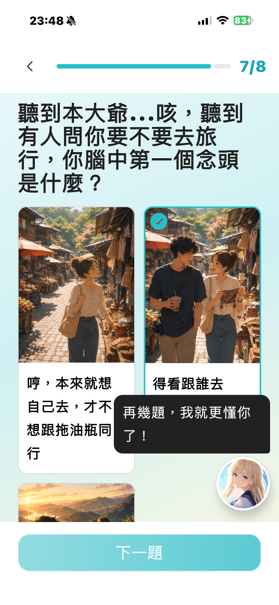 |
| 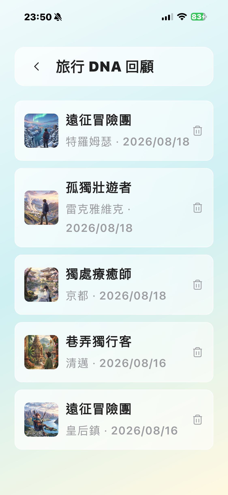 | 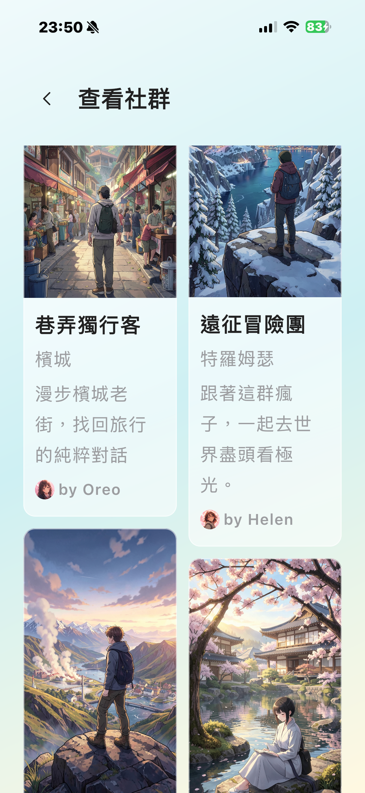 |
| 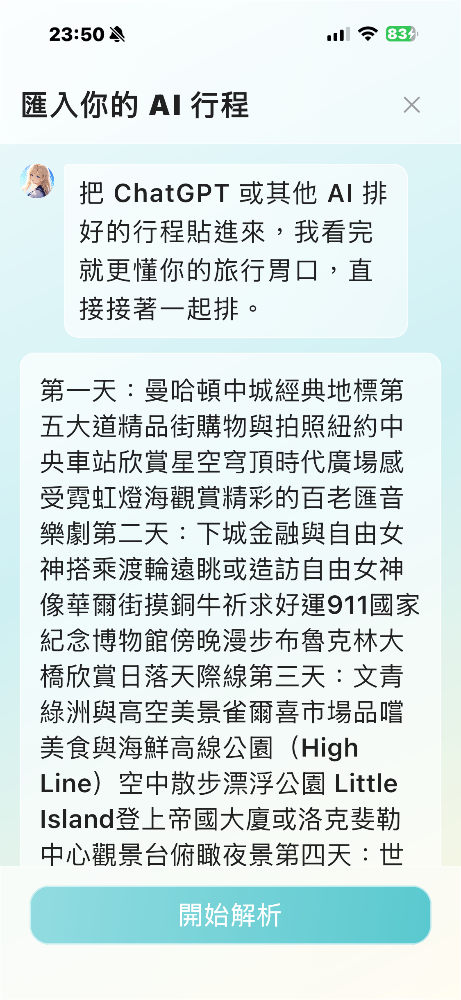 | 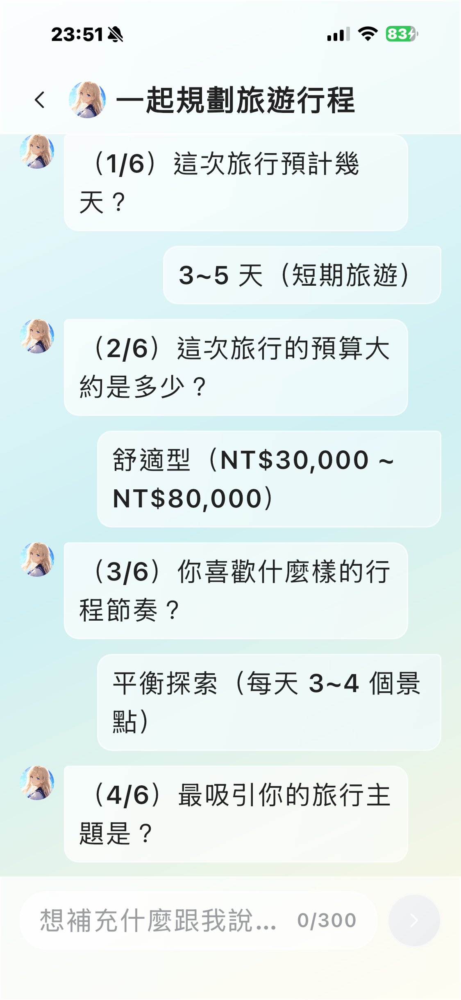 |
| 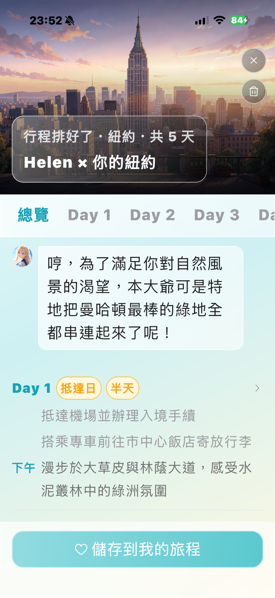 | 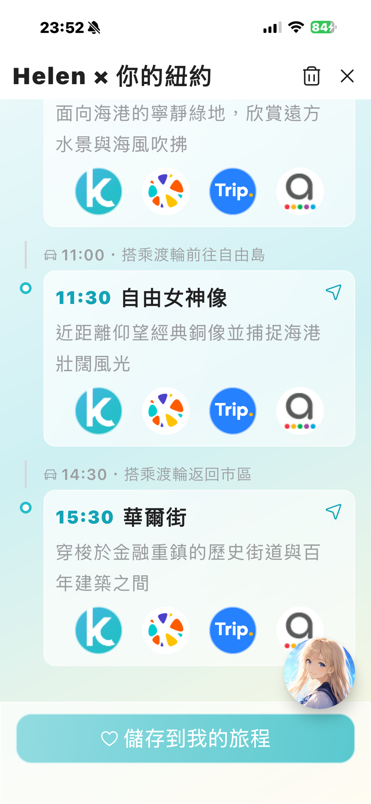 |
| 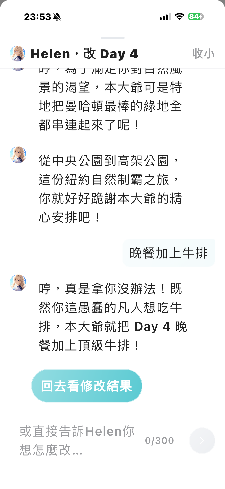 |  |

## Demo Video

[Watch the product demo on Google Drive](https://drive.google.com/file/d/1iu8AOjlXIEji7bLiP2vw6aIL2KHqXAVG/view?usp=sharing)