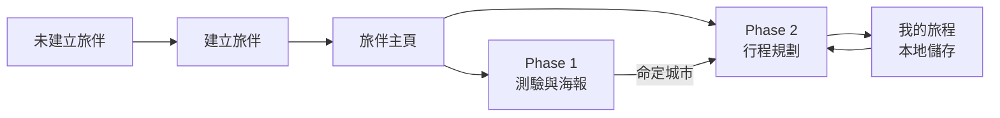
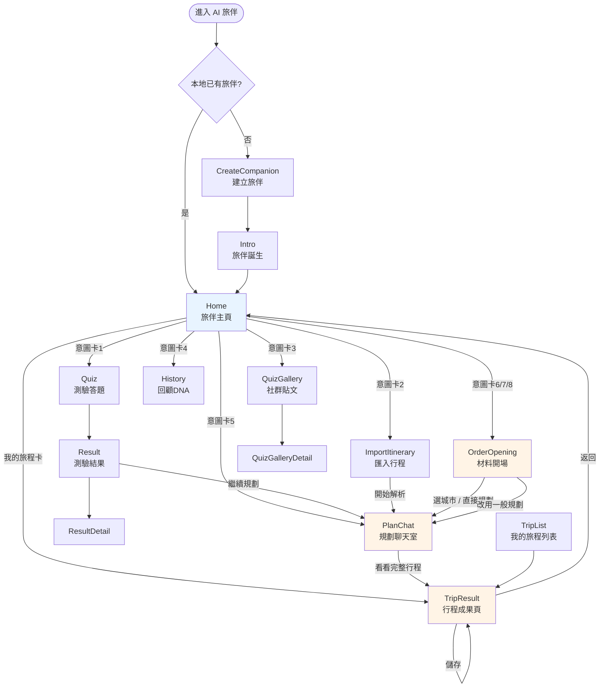
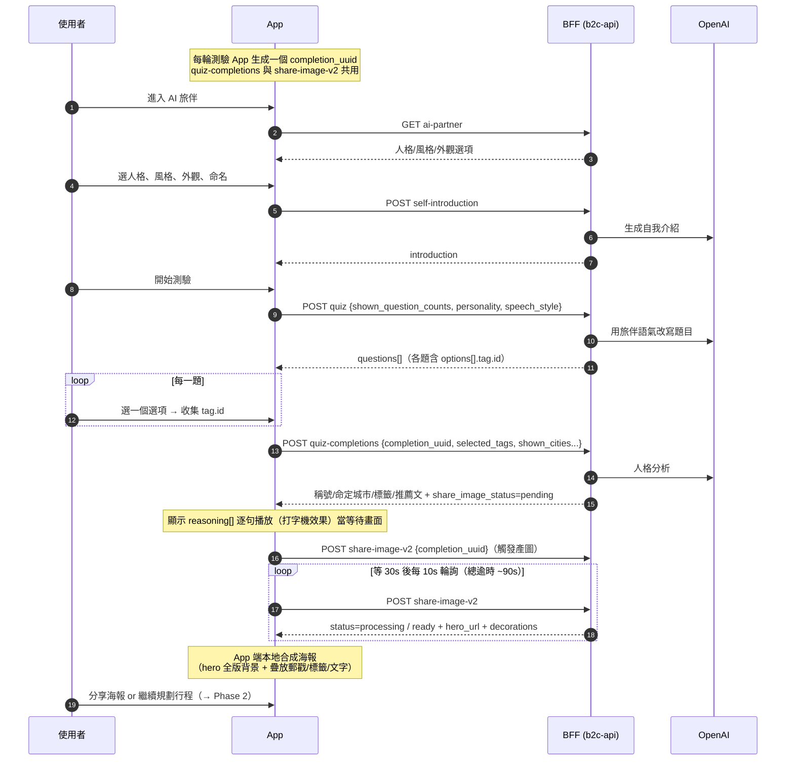
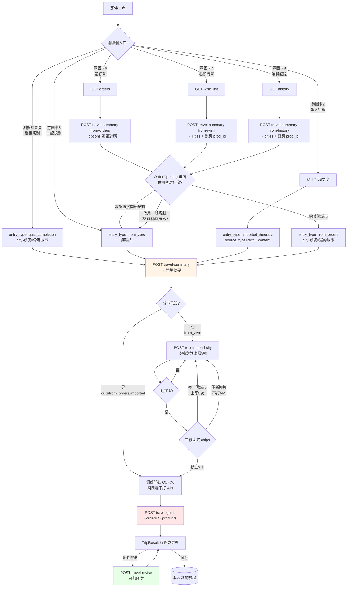
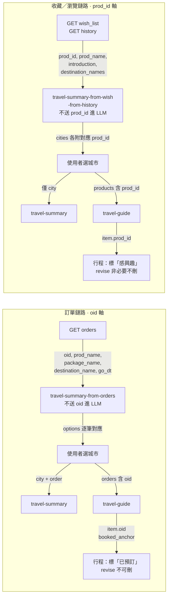

# AI 旅伴 完整功能指南（RD 交接／新手教學）

> **這份文件的定位**：接手 AI 旅伴（AI Companion）功能的工程師，讀完這一份就能理解全貌並開始實作。涵蓋 Phase 1（旅伴與測驗）+ Phase 2（行程規劃）的所有頁面、所有 API、所有流程分支、所有 LLM 互動邏輯。
>
> **對應實作**：Android `libs/feature/ai_companion/`
> **後端規格**：b2c-api repo `docs/ai-companion-api.md`（Phase 1）、`docs/ai-companion-phase2-api.md`（Phase 2）
> **iOS 交接**：`ios-handoff-material-apis.md`、`ios-handoff-order-search.md`、`ios-handoff-wish-history.md`

---

## 目錄

1. [五分鐘理解全貌](#一五分鐘理解全貌)
2. [三個設計前提（先讀，影響所有實作）](#二三個設計前提先讀影響所有實作)
3. [API 總表（16 支）](#三api-總表16-支)
4. [頁面總表與關聯圖](#四頁面總表與關聯圖)
5. [Phase 1 完整流程](#五phase-1-完整流程旅伴與測驗)
6. [Phase 2 完整流程](#六phase-2-完整流程行程規劃)
7. [LLM 互動與對話管理](#七llm-互動與對話管理)
8. [資料鏈路：材料如何一路傳到行程](#八資料鏈路材料如何一路傳到行程)
9. [錯誤處理總表](#九錯誤處理總表)
10. [程式碼地圖](#十程式碼地圖)

---

## 一、五分鐘理解全貌

AI 旅伴是「一位有名字、有個性的 AI 旅遊夥伴」，分兩階段：

| | Phase 1（已上線） | Phase 2（試驗中） |
|---|---|---|
| 一句話 | **認識你** | **幫你排** |
| 做什麼 | 捏旅伴 → 玩旅行 DNA 測驗 → 人格分析＋命定城市 → 分享海報 | 五種入口開場 → 收斂目的地 → 偏好問卷 → 生成逐日行程 → 自然語言修改 |
| 產出 | 偏好標籤、命定城市、可分享海報 | 一份可執行、含 KKday 商品的完整行程 |
| API 數 | 6 支 | 10 支 |

**兩階段的銜接**：測驗結果頁「繼續規劃」＝Phase 1 → Phase 2 的主轉換點（命定城市直接成為行程規劃起點）；旅伴人設（`companion_name`/`personality`/`speech_style`）作為參數貫穿 Phase 2 所有 LLM API，維持同一角色語氣。



---

## 二、三個設計前提（先讀，影響所有實作）

### 1. 完全無狀態（Stateless）

後端**不使用資料庫、不做任何 server 端持久化**。沒有 `conversation_id`、`trip_id`、`session_id` 這類需要 server 記憶的識別碼。

| 誰負責保存 | 保存什麼 |
|---|---|
| **App 端本地** | 旅伴設定、測驗歷史、對話紀錄、目前最新的 summary/city、行程資料（「我的旅程」） |
| 後端 | 什麼都不記得（除了 quiz 分析 24h 快取與 gallery 的 Redis 清單） |

**實作結果**：每次 API 呼叫都要**帶齊這次所需的全部輸入**。例如多輪對話要把完整歷史全量帶回、修改行程要把當前完整行程帶回。

### 2. 軟失敗模式（Soft Fail）

LLM 失敗**一律回 HTTP 200 + `fail_reason` 有值**，內容欄位是兜底文案。

```
判斷成敗 → 看 data.fail_reason 是不是 null（不要只看 HTTP 或 metadata.status）
重試方式 → 原樣重打同一份 request（所有 API 皆無狀態、無副作用，可安全重試）
後端不重試 LLM（避免重複計費），重試主導權在 App
```

**例外**：HTTP 400（`metadata.status="110001"`，**沒有 `data` 欄位**）＝request 本身組錯（缺必填欄位等），要修呼叫方式，不是重試。

```kotlin
// Android 端統一處理：CompanionRepositoryImpl.checkCompanionMetadata() / toTravelPlanException()
// 400 → TravelPlanValidationException → UI 顯示「發生錯誤」不給重試鈕
// 其他 → 一般 Exception → UI 顯示「連線出問題」給重試鈕
// 200 + fail_reason → Result.success 但 isGenerateSuccess=false → UI 顯示兜底文案＋重新生成鈕
```

### 3. 不驗證身份 + Throttle 防濫用

companion API **不掛登入驗證**（`x-auth-token` 照送但不驗證內容），靠路由 throttle 防成本型濫用。

---

## 三、API 總表（16 支）

全部在 `/api/v3/companion/`，Android 定義於 [ICompanionApiService.kt](libs/networking/api/src/main/java/com/kkday/library/networking/service/companion/ICompanionApiService.kt)。

### Phase 1（6 支）

| # | Method | 路徑 | 用途 | 打 LLM |
|---|---|---|---|---|
| 1 | GET | `ai-partner` | 人格/說話風格/外觀選項（建立旅伴 UI） | ❌ |
| 2 | POST | `self-introduction` | 旅伴自我介紹文案 | ✅ |
| 3 | POST | `quiz` | 取一批測驗題（AI 改寫語氣） | ✅ |
| 4 | POST | `quiz-completions` | 提交答案 → 人格分析＋命定城市 | ✅ |
| 5 | POST | `share-image-v2` | 海報素材（按需產圖＋輪詢） | ✅ 產圖 |
| 6 | GET | `quiz-gallery` | 社群牆（其他人的測驗結果） | ❌ |

### Phase 2 — 材料層（3 支，取開場材料）

| # | Method | 路徑 | 用途 | 打 LLM |
|---|---|---|---|---|
| 7 | GET | `orders` | 即將出發的訂單（形狀同 `v2.2/orders`） | ❌ |
| 8 | GET | `wish_list` | 收藏（心願清單）商品 | ❌ |
| 9 | GET | `history` | 瀏覽/購買紀錄商品 | ❌ |

> 三支目前皆為 **mock/假資料端點**，走一般登入態、GET 無參數無 body。

### Phase 2 — 開場層（3 支，材料 → 城市選項）

| # | Method | 路徑 | 用途 | Throttle |
|---|---|---|---|---|
| 10 | POST | `travel-summary-from-orders` | 訂單 → greeting + 城市選項（逐筆對應 `order_index`） | 10/min |
| 11 | POST | `travel-summary-from-wish` | 收藏商品 → greeting + 城市（聚合，附對應 `prod_id`） | 10/min |
| 12 | POST | `travel-summary-from-history` | 瀏覽商品 → 同上 | 10/min |

### Phase 2 — 規劃層（4 支，核心）

| # | Method | 路徑 | 用途 | Throttle |
|---|---|---|---|---|
| 13 | POST | `travel-summary` | 聊天室開場摘要（4 種 `entry_type`） | 20/min |
| 14 | POST | `recommend-city` | 城市收斂多輪對話（上限 5 輪） | 30/min |
| 15 | POST | `travel-guide` | 一次生成完整逐日行程 | 15/min |
| 16 | POST | `travel-revise` | 自然語言修改既有行程 | 20/min |

### 非 companion API（App 端額外串接）

| Method | 路徑 | 用途 | 特殊處理 |
|---|---|---|---|
| POST | `v2.1/search/product_list` | 行程景點的 KKday 商品搜尋卡 | **固定打正式環境**（測試環境商品太少），需覆寫 `x-auth-token` |

---

## 四、頁面總表與關聯圖

Android 以 `AiCompanionStep` enum 管理頁面切換（單 Activity + Compose，非 Navigation Component）。

### 頁面總表

| Step | 畫面名稱 | 階段 | 主要內容 | 使用者可操作 |
|---|---|---|---|---|
| `CreateCompanion` | 建立旅伴 | P1 | 人格/風格/外觀選項、命名輸入 | 選人格、選說話風格、選外觀、命名、確認建立 |
| `Intro` | 旅伴誕生 | P1 | 旅伴形象＋AI 自我介紹文案 | 進入主頁、重新捏一個 |
| `Home` | **旅伴主頁** | P1/P2 | 旅伴形象、人設標籤、8 張意圖卡、我的旅程橫向清單 | 8 個功能入口、點行程卡、重捏旅伴、返回 |
| `Quiz` | 測驗答題 | P1 | 一次一題的情境選擇題（含圖片選項） | 選答案、換一批題目 |
| `Result` | 測驗結果 | P1 | 人格稱號、命定城市、標籤、推薦文、海報 | 分享海報、**繼續規劃行程**（→P2）、看細節 |
| `ResultDetail` | 結果細節 | P1 | 完整分析文字 | 返回 |
| `History` | 回顧旅行 DNA | P1 | 過去測驗結果清單 | 點開舊結果、重新分享 |
| `QuizGallery` | 社群旅伴貼文 | P1 | 其他人的測驗結果牆 | 點看某一則 |
| `QuizGalleryDetail` | 社群貼文細節 | P1 | 單則結果詳情 | 返回 |
| `OrderOpening` | **材料開場** | P2 | greeting 泡泡＋城市 chips | 選城市、我想直接開始規劃、改用一般規劃、重試 |
| `ImportItinerary` | 匯入 AI 行程 | P2 | 文字貼上框 | 貼上行程、開始解析 |
| `PlanChat` | **規劃聊天室** | P2 | 開場摘要泡泡、城市對話、偏好問卷、完成宣告 | 打字輸入、點 chips、回答問卷、開始規劃、看完整行程 |
| `TripResult` | **行程成果頁** | P2 | hero、總覽/Day 分頁、時間軸、商品卡、旅伴 FAB | 切分頁、拖曳排序、開地圖、點商品卡、開修改對話、儲存行程 |
| `TripList` | 我的旅程列表 | P2 | 本地儲存的行程清單 | 點開行程、刪除 |

> 另有 **Bottom Sheet**（非獨立 Step）：`TripReviseSheet`（修改對話）、`CompanionProfileSheet`（旅伴資訊）。

### 頁面關聯圖



---

## 五、Phase 1 完整流程（旅伴與測驗）

### 使用者流程圖



### 各頁面詳解與 API in/out

#### ① CreateCompanion（建立旅伴）

| 項目 | 內容 |
|---|---|
| 呈現 | 人格特質選項、說話風格選項、外觀（性別/髮型/穿著）、名字輸入框 |
| 操作 | 多選人格（限 1）、選風格、選外觀、輸入名字（≤20 字）、確認建立 |
| API | `GET ai-partner` |
| **Input** | 無 body |
| **Output** | `data` = DCS 設定的選項物件；App 取 `personality[].tag`／`speech_style[].tag`／`gender[].tag` 作為後續參數值 |
| 注意 | `data` 為空代表該環境 DCS 未設定，需請後端/營運補上 |

#### ② Intro（旅伴誕生）

| 項目 | 內容 |
|---|---|
| 呈現 | 旅伴形象＋AI 生成的自我介紹 |
| 操作 | 「進入主頁」、「重新捏一個」 |
| API | `POST self-introduction` |
| **Input** | `{companion_name, personality, speech_style, gender}`（四個都必須是 `ai-partner` 回傳的當下選項，亂傳會 400） |
| **Output** | `{introduction, ai_model, fail_reason}` |
| 注意 | `fail_reason` 有值＝LLM 失敗但 `introduction` 已 fallback 固定文案，直接顯示即可 |

#### ③ Home（旅伴主頁）

**Phase 1 與 Phase 2 的總入口**，是整個功能的中樞。

| 區塊 | 內容 | 操作 |
|---|---|---|
| Toolbar | 返回、標題、overflow menu | 返回、重捏旅伴 |
| 旅伴形象區 | 頭像、名字、人設標籤 | 點頭像開 profile sheet |
| ~~理解度卡~~ | 「即將推出」進度條 | *（目前 `if(false)` 隱藏）* |
| 「想跟{旅伴}一起做什麼呢？」 | 標題 | — |
| 我的旅程 | 橫向捲動行程卡（僅有存過時顯示） | 點卡片 → `TripResult` |
| **8 張意圖卡** | 見下表 | 各自進入對應頁面 |
| ~~底部聊天 bar~~ | 「直接和{旅伴}聊聊」 | *（目前 `if(false)` 隱藏）* |

**8 張意圖卡（順序即畫面由上而下）**：

| # | 標題 | 副標 | 目的地 |
|---|---|---|---|
| 1 | 找到我的旅行 DNA 及命定旅程 | 玩個測驗，發現你的旅行性格與最適合的目的地 | `Quiz` |
| 2 | 匯入你的 AI 行程 | 把 ChatGPT／其他 AI 排好的貼給我… | `ImportItinerary` |
| 3 | 社群旅伴貼文 | 看別人的旅伴與命定城市，逆向找旅行靈感 | `QuizGallery` |
| 4 | 回顧我的旅行 DNA | 看過去的測驗結果與海報，隨時再分享 | `History` |
| 5 | 一起規劃旅遊行程 | 還沒有想法？沒關係，從頭聊，一步步排出來 | `PlanChat`（from_zero） |
| 6 | 一起規劃旅遊行程(帶訂單) | — | `OrderOpening`（orders） |
| 7 | 一起規劃旅遊行程(從心願清單) | 從你收藏過的商品，找出你想去的地方 | `OrderOpening`（wish） |
| 8 | 一起規劃旅遊行程(從瀏覽記錄) | 從你最近看過的商品，找出你想去的地方 | `OrderOpening`（history） |

#### ④ Quiz（測驗答題）

| 項目 | 內容 |
|---|---|
| 呈現 | 題目文字（AI 改寫語氣）、選項（含圖片）、進度 |
| 操作 | 選一個選項 → 下一題；可換一批題目 |
| API | `POST quiz` |
| **Input** | `{shown_question_counts: {"1-3": 2}, personality, speech_style}` — `shown_question_counts` 是 App 本地維護的「題目出現次數」，key = `"{dimension_id}-{index}"`，出現越多次越不容易再被抽中 |
| **Output** | `{count, questions[], fail_reason}`；每題 `{id, dimension_id, text, options[{id, text, image_url, tag{id, label}}]}` |
| 收集 | 使用者每題選的 `options[].tag.id`（如 `t1-1`）組成 `selected_tags` |
| 注意 | `fail_reason` 有值＝LLM 改寫失敗，`questions` 是**未改寫的原始文案**（不是整支失敗，照常顯示） |

#### ⑤ Result（測驗結果）→ Phase 2 的主要轉換點

| 項目 | 內容 |
|---|---|
| 呈現 | 旅行人格稱號、命定城市、亮點標籤、旅伴一句話、3 段推薦文、合成海報 |
| 操作 | 分享海報、**「繼續規劃行程」（→ PlanChat）**、看細節 |
| API | `POST quiz-completions` → `POST share-image-v2`（輪詢） |

**`quiz-completions`**：

| | 內容 |
|---|---|
| **Input** | `{completion_uuid, personality, speech_style, selected_tags[], shown_cities[], companion_name, partner_avatar_url}` |
| **Output** | `{quiz_completion_id, travel_identity(_en), destination_cn/_en, destination_country, tagline, highlight_tags[], companion_quote, recommendation[], reasoning[], social_post, share_image_status, fail_reason}` |
| 重點 | `travel_identity` 是**八種固定稱號之一**（後端 tag mapping 判定，非 AI 自由生成）；`recommendation` 是**陣列**要逐段渲染；`reasoning` 是「AI 思考過程」給等待畫面逐句播放用（**可能為空陣列**，要準備一般 loading）；`share_image_status=pending` 才可接著打 share-image-v2 |

**`share-image-v2`（重點：輪詢節奏）**：

| | 內容 |
|---|---|
| **Input** | `{completion_uuid, partner_image_url}` |
| **Output** | `{status: "ready"/"processing", hero_url, hero_fallback_category, content{...}, decorations{stamp_url, tag_icon_urls[3], ...}, fail_reason}` |
| 輪詢 | 首打＝觸發產圖（結果可忽略）→ **等 30s** → 每 **10s** 輪詢 → 總逾時 ~90s |
| 重點 | **沒有 `failed` 狀態**，只有 `ready`/`processing`；個別素材 `null` 時依 `*_fallback_category` 用內建素材降級，**不可留空白或破圖**；版面由 App 端合成，**不可只分享 hero 原圖** |
| 錯誤 | `metadata.status="C007"`（扁平格式）＝分析快取過期 → 引導重跑測驗 |

#### ⑥ History / QuizGallery

| 頁面 | API | Input | Output |
|---|---|---|---|
| History（回顧 DNA） | 無（純本地 DataStore） | — | 本地保存的 `QuizHistoryRecord[]`，依 memberUuid 區分 |
| QuizGallery（社群牆） | `GET quiz-gallery` | 無 body | `{count, items[]}`；`items[].share_image_url` 恆有值（清單只收錄產圖成功的），`partner_avatar_url` 可能 null |

---

## 六、Phase 2 完整流程（行程規劃）

### 五種入口的抉擇路徑



### ① OrderOpening（材料開場）— 三種材料入口共用

| 項目 | 內容 |
|---|---|
| 呈現 | 頂部 bar（標題「一起規劃旅遊行程」）＋打字中泡泡 → greeting 泡泡＋城市 chips |
| 操作 | 點某個城市 chip、點「我想直接開始規劃」、（失敗時）「改用一般規劃」、「重試」 |

**Step 1：取材料**（詳見 `ios-handoff-material-apis.md`）

| 入口 | API | 萃取欄位 | 排序/截取 |
|---|---|---|---|
| 訂單 | `GET orders` | `id`→oid、`prod_name`、`package_name`、`destination.destinations[0].name`、`lst_dt_go`→`go_dt`(yyyy-MM-dd) | 過濾無出發日 → 依出發日升冪 → **前 3 筆** |
| 心願清單 | `GET wish_list` | `prod_mid`→`prod_id`(字串)、`name`、`introduction`(≤500字)、`destinations[].name` | 過濾空 id/名稱 → **前 20 筆** |
| 瀏覽記錄 | `GET history` | 同上 | 同上 |

**Step 2：LLM 判斷城市**

| API | Input | Output |
|---|---|---|
| `travel-summary-from-orders` | `{orders[{prod_name, package_name, destination_name}], companion_name, personality, speech_style}` | `{greeting, options[{order_index, city}], ai_model, fail_reason}` — **逐筆對應**（`order_index` 0-based） |
| `travel-summary-from-wish` / `-from-history` | `{products[{prod_id, prod_name, introduction, destination_names[]}], companion_name, ...}` | `{greeting, cities[{city, products[{prod_id, prod_name}]}], ai_model, fail_reason}` — **聚合**（多商品可歸同城市） |

> **後端防呆**：送進 LLM 的材料**刻意不含編號**，模型只回位置索引，`prod_id`/`oid` 全由後端依索引取回 → 回應的編號**保證是你送過去的值之一**，不會有幻覺編號。

**Step 3：畫面分支**

| 情況 | 判斷 | 畫面 |
|---|---|---|
| 正常 | `cities`/`options` 有值 | greeting 泡泡＋城市 chips＋**「我想直接開始規劃」chip** |
| 材料為空 | `prods[]`/`orders[]` 為空 | 「咦，我沒找到可以參考的資料耶…」＋「改用一般規劃」 |
| LLM 軟失敗 | 200 但 `cities` 空（`fail_reason`=`llm_error`/`low_confidence`） | 兜底 greeting＋「改用一般規劃」（不需區分兩種 fail_reason） |
| 硬失敗 | 拋錯 | 錯誤泡泡＋「重試」（**重跑自己這條流程**）＋「改用一般規劃」 |

### ② PlanChat（規劃聊天室）— Phase 2 的核心互動場域

這一頁包含**四個階段**的內容，全部堆疊在同一個捲動聊天室裡由上而下增長：

```
[前導訊息]  材料開場的 greeting + 使用者的選擇（城市名／「我想直接開始規劃」）
     ↓
[開場摘要]  travel-summary 的 summary 泡泡 + chips
     ↓
[城市對話]  recommend-city 多輪泡泡（僅 from_zero 路徑）
     ↓
[偏好問卷]  Q1~Q6 一次一題（純前端）
     ↓
[完成時刻]  travel-guide 的完成宣告 + 「看看完整行程」主行動
```

| 項目 | 內容 |
|---|---|
| 呈現 | 頂部 bar（旅伴頭像＋標題）＋捲動對話區＋底部輸入列 |
| 操作 | 打字送出、點 chips、回答問卷、「開始規劃」、「看看完整行程」、返回 |

**底部輸入列的統一分流邏輯**（`sendPlanInput()`）：

```kotlin
when {
    問卷進行中 && 未答完   -> answerPreference(text)      // 當作回答目前題目
    城市對話中 && 未收斂   -> sendCityMessage(text)       // 下一輪 recommend-city
    from_zero && 尚未開始城市對話 -> 啟動城市對話 + 送出這句
    else                  -> supplementTravelSummary(text) // 補充重生成摘要
}
```

#### travel-summary（開場摘要）

| entry_type | 使用情境 | Input（除共用 persona 外） | 回傳 city 來源 |
|---|---|---|---|
| `quiz_completion` | 測驗結果頁繼續規劃 | **`city` 必填**（命定城市）+ `city_image_url` + `intro_text` | **請求原樣回傳**（權威，不經 LLM） |
| `from_orders` | 材料開場選定城市後 | **`city` 必填**（選的城市）+ `order`（選填，訂單材料，開場白會呼應商品） | **請求原樣回傳** |
| `imported_itinerary` | 匯入行程 | `source_type=text` + `content`（≤30000 字） | LLM 從內容推斷 |
| `from_zero` | 從零開始／直接開始規劃 | 無 | 空字串（**不打 LLM**，回固定文案） |

**Output**：`{summary, city, ai_model, fail_reason}`

**補充重打**（「資訊不夠，我想補充」）：帶 `previous_summary`（前次回傳的 summary）+ `note`（補充說明）重打 → 後端整合成**新的一份**取代前一版（不是接在後面）。App 只需保存「目前最新的 summary」。

#### recommend-city（城市收斂多輪對話）

僅 `from_zero` 路徑會走。

| | 內容 |
|---|---|
| **Input** | `{messages[{role, content}], shown_cities[], companion_name, personality, speech_style}` — `messages` **必填 1~20 則**，完整對話歷史全量帶入，最後一則是本次使用者輸入 |
| **Output** | `{reply, quick_replies[], recommended_city, city_reason, is_final, off_topic, round, max_rounds, remaining_rounds, swap_limit_reached, ai_model, fail_reason}` |

**輪次機制**（伺服器算，App 不用管）：

| 輪次 | 行為 |
|---|---|
| 1~3 | 自由對話收斂，LLM 覺得夠了可**提前**給城市（`is_final=true`） |
| 4 | 回覆結尾**必定提醒**「下次輸入就會選出城市」 |
| 5 | **強制輸出**城市，不再提問 |

**收斂後的三顆固定 chips**（後端強制覆寫，App 依文字綁行為）：

| chip | App 行為 |
|---|---|
| `就去{城市}！` | 接受 → 城市帶進 travel-guide → 進入偏好問卷 |
| `換一個城市` | 把推薦城市加進 `shown_cities` 後**原樣重打**（推薦文與 chip 文字不進 API messages）；**上限 5 次** |
| `重新聊聊` | **純 App 端行為不打 API**：清空 messages 與 shown_cities 回到第 1 輪（畫面文字保留） |

**串接注意事項**（sit 實測整理）：
1. 判斷收斂**只看 `is_final`**，不要自己數輪次（會漏接提前收斂）
2. 同一份對話重打可能推不同城市（LLM 隨機性，試驗階段可接受）
3. 使用者全程亂聊也會拿到城市（離題輪次照樣計數，第 5 輪強制收斂）
4. `fail_reason` 有值時 `reply` 是兜底文案 → 照常渲染但**不要 append 進 messages**（會污染上下文）

#### 偏好問卷（Q1~Q6，純前端不打 API）

題目寫死在 [AiCompanionStates.kt](libs/feature/ai_companion/src/main/java/com/kkday/feature/ai_companion/viewModel/AiCompanionStates.kt) 的 `PLAN_PREFERENCE_QUESTIONS`（未來搬 DCS，後端不驗證 key）：

| key | 題目 | 選項 |
|---|---|---|
| `duration` | 這次旅行預計幾天？ | 1~2 天／3~5 天／6~9 天／10 天以上 |
| `budget` | 這次旅行的預算大約是多少？ | 經濟型／小資型／舒適型／豪華型 |
| `pace` | 你喜歡什麼樣的行程節奏？ | 悠閒放鬆／平衡探索／緊湊充實 |
| `theme` | 最吸引你的旅行主題是？ | 城市文化／自然風景／主題樂園與親子／購物與時尚 |
| `priority` | 你最在意什麼？ | 美食與購物／風景與拍照／文化體驗／放鬆休息 |
| `notes` | 還有什麼想法或特殊需求嗎？（自由輸入） | 「沒有特別需求」＝跳過，不放進 preferences |

送出時 value 用**選項的顯示文字**（不是代號），LLM 直接讀語意。

#### travel-guide（生成完整行程）

| | 內容 |
|---|---|
| **Input** | `{summary, city, preferences{}, orders[]?, products[]?, companion_name, personality, speech_style}` |
| **Output** | `{city, days, phase, unplanned_days[], pending_fields[], messages[], itinerary_patch{mode:"full", changed_days[], days[]}, progress_label, chips, main_action, ai_model, fail_reason}` |

**`orders[]` vs `products[]`（兩條獨立的軸）**：

| | `orders[]`（≤3 筆） | `products[]`（≤10 筆） |
|---|---|---|
| 來源 | 帶訂單入口 | 心願清單／瀏覽記錄入口選定城市對應的商品 |
| 欄位 | `{oid, prod_name, package_name, destination_name, go_dt}` | `{prod_id, prod_name, introduction, destination_names[]}` |
| 效果 | 必排入行程，item 回填 `oid`，該天 `booked_anchor` 有值 | 必排入行程，item 回填 `prod_id`，**不影響 booked_anchor** |
| 語意 | **已預訂**（已付錢） | **想去但還沒買** |

**`itinerary_patch.days[].items[]` 欄位**：

| 欄位 | 說明 |
|---|---|
| `name` | 地點/店家純名稱（`spot`/`meal` 必填，`logistics` 通常 null） |
| `text` | 一句話描述（不含地點名稱本身） |
| `type` | `spot`（景點）／`logistics`（交通後勤）／`meal`（用餐） |
| `time` | 精確時刻 `HH:MM` |
| `time_band` | 模糊時段（舊版 fallback，新版優先用 `time`） |
| `transport_mode` | **僅 logistics**：`walk`/`bus`/`train`/`car`/null（非移動性質的後勤為 null） |
| `lat`/`lng` | **僅 spot**：LLM 推算的**近似座標**，僅供地圖大致標點，**不可用於導航** |
| `oid`／`prod_id` | 對應的訂單／商品編號（見上表） |

> **商業資訊禁令**：`name`/`text`/`note` 不會出現價格、庫存、營業時間、供應商名稱（prompt 明文禁止捏造）。若實測看到，代表 prompt 約束失效要回報。

### ③ TripResult（行程成果頁）

| 區塊 | 呈現 | 操作 |
|---|---|---|
| Hero | 城市大圖＋壓字標題（「{旅伴} × 你的{城市}」） | 關閉返回 |
| 分頁列 | 「總覽」＋「Day 1」「Day 2」… | 切換分頁 |
| 總覽分頁 | 旅伴完成宣告泡泡＋逐日摘要區塊 | 點某天 → 切到該 Day 分頁 |
| Day 分頁 | Day 標題＋標籤＋統計列（N 個景點・N 個用餐）＋**時間軸** | — |
| 時間軸項目（spot/meal） | 圓點＋卡片：時間＋標題＋副標＋備註＋「已預訂」/「感興趣」標籤＋導航鈕＋**KKday 商品卡** | **長按拖曳排序**、點導航開地圖、點商品卡開搜尋結果頁 |
| 時間軸項目（logistics） | 輕量交通列＋交通方式 icon | — |
| 旅伴 FAB | 右下角 100dp 圓形頭像（**跨天共用單一實例、可拖曳、位置保留**） | 點擊開修改對話、拖曳換位置 |
| 底部 bar | 「儲存到我的旅程」 | 儲存（**留在本頁不關閉**） |

**KKday 商品卡（App 端額外功能，非 companion API）**：

| | 內容 |
|---|---|
| 觸發 | 每個景點以 `"{城市} {景點名}"` 為關鍵字背景搜尋（同名景點防誤配） |
| API | `POST v2.1/search/product_list`，**固定打正式環境**（`https://api-b2c.kkday.com/api/`，測試環境商品太少），需覆寫 `x-auth-token` 為正式環境值 |
| Input | `{start:0, count:10, q, rewrite:"1", translate_status:1, page_name:"product_list_mobile"}`（`page_name` 必填，少帶回 400） |
| 顯示 | 第一項商品縮圖卡＋「還有 N 項相關商品」（N = `metadata.pagination.total_count - 1`，**不是** `prods.size`） |
| 點擊 | App Link deeplink `https://www.kkday.com/zh-tw/product/productlist?keyword={景點名}`（host **固定正式環境**，否則 App Link 驗證對不上會掉到瀏覽器） |
| 失敗 | 找不到或失敗 → 不顯示卡片，不顯示錯誤（純附加功能） |

### ④ TripReviseSheet（修改對話 Bottom Sheet）

| 項目 | 內容 |
|---|---|
| 呈現 | 距頂 100dp 的全螢幕 sheet；標頭（頭像＋「{旅伴}・改 Day n」＋收小）＋對話區＋輸入列 |
| 對話內容 | **整個聊天室的完整對話**（含進入行程頁之前的規劃對話），不分天、不分次 |
| 操作 | 打字送出修改需求、重試、「回去看修改結果」、收小 |

**對話保留規則**（重要）：

```
開啟 sheet  → 從 companionTranscript 重建畫面訊息（跨天、跨開關都是同一份）
關閉 sheet  → 只設 active=false，紀錄與狀態全保留
離開頁面    → ViewModel 銷毀才清除
切換不同天  → 對話不變，只有 target_day 換
```

#### travel-revise

| | 內容 |
|---|---|
| **Input** | `{itinerary[]（當前最新完整行程，扁平陣列不包 days）, messages[]（必填 1~100 則，整個聊天室完整對話，最後一則是本次需求）, city?, target_day?, preferences?, orders?, products?, companion_name, ...}` |
| **Output** | `{reply, changed_summary, off_topic, city, days, phase, itinerary_patch{mode:"full", changed_days[], days[]}, progress_label, main_action, ai_model, fail_reason}` |

**關鍵規則**：

1. **沒有 `request` 欄位**（2026-08 改版移除）——這次需求＝`messages` 最後一則 `role=user`
2. `messages` 要放**整個聊天室從頭到尾**（開場摘要、城市收斂、完成宣告、每輪修改），不是只有這次 bottom sheet 的小段落。LLM 讀完整段歷史再決定怎麼改，但**只處理最後一則需求**（舊需求不會重複套用）
3. 回應永遠是**完整行程**（`mode:"full"`），整包替換即可；但 Android 端仍做**以天為單位的 upsert merge** 保底（實測後端曾只回變動天）
4. `off_topic=true`＝離題導回（**不是失敗**，`fail_reason=null`），行程原樣返回
5. 行程內既有 `oid`（不可刪）/`prod_id`（非必要不刪）**自動白名單保護**，每輪**不需要重帶** `orders`/`products`
6. **無次數上限**，可一直改下去（靠 throttle 20/min 防濫用）

### ⑤ TripList（我的旅程列表）

| 項目 | 內容 |
|---|---|
| API | 無（純本地 DataStore，依 memberUuid 區分，最新在前） |
| 操作 | 點開行程 → `TripResult`、刪除 |
| 注意 | 開啟不同行程時會**清空 `companionTranscript`**（避免不同行程的對話混在一起傳給 travel-revise） |

---

## 七、LLM 互動與對話管理

### 三份對話資料的分工（容易搞混，務必理解）

| 名稱 | 用途 | 進入條件 | 清空時機 |
|---|---|---|---|
| `companionTranscript` | **travel-revise 全量帶入的完整對話** | 畫面上出現的每一則泡泡（旅伴/使用者皆是），**軟失敗兜底文案不進** | 開新一輪規劃（`startTravelSummary`）、開啟不同的已存行程 |
| `cityChatHistory` | **recommend-city 的 API 參數** | 一般輪的使用者輸入＋回覆；**收斂輪推薦文、「換城市」、「重新聊聊」不進** | 「重新聊聊」、開新一輪規劃 |
| `RecommendCityState.messages` | **畫面顯示用** | 所有泡泡（含收斂輪推薦文與 chip 選擇） | 開新一輪規劃（「重新聊聊」時保留畫面文字） |

> 為什麼要分三份：`cityChatHistory` 刻意排除「換一個城市」相關文字（排除已推薦城市由 `shown_cities` 負責，多餘文字不需要 LLM 思考）；`companionTranscript` 要的是「使用者說過什麼」的完整脈絡；畫面則要顯示所有互動軌跡。

### LLM 回傳內容的處理原則

| 情況 | 判斷 | 處理 |
|---|---|---|
| 成功 | `fail_reason == null` | 正常渲染，**append 進對話紀錄** |
| 軟失敗 | `fail_reason` 有值（仍 200） | 渲染兜底文案，**不 append 進歷史**（避免污染上下文），提供「重新生成」原樣重打 |
| 離題（僅 revise/recommend-city） | `off_topic == true` | 渲染導回文案，**不是失敗**，行程不變 |
| 硬失敗 | 拋 Exception | 錯誤泡泡＋「重試」 |
| 驗證錯誤 | HTTP 400 / `110001` | 通用錯誤提示，**不給重試**（要修呼叫方式） |

### 延遲預算與 timeout 建議

| 端點 | 延遲預算 | 建議 timeout |
|---|---|---|
| `travel-summary`（A/B） | <10s | ≥20s |
| `travel-summary`（from_zero） | <50ms（不打 LLM） | — |
| `travel-summary-from-*` | <8s | ≥15s |
| `recommend-city` | <10s／輪 | ≥20s |
| `travel-guide` | 依天數 5~30s | **≥45s** |
| `travel-revise` | <15s | ≥30s |

---

## 八、資料鏈路：材料如何一路傳到行程

三支材料 API 萃取的欄位**不是取完顯示就丟**，而是一路往下游傳。這是整個 Phase 2 材料入口的設計核心。



### 四個關鍵相關性

1. **同一份萃取材料被用兩次**：第一次餵給 `travel-summary-from-*` 判斷城市，第二次餵給 `travel-guide` 排入行程。App 端要把原始材料**保留到 travel-guide 打完為止**（Android 用 `prod_id`/`oid` 當 key 回查原始材料補齊欄位）。

2. **編號欄位是「保證排入行程」的憑證**：`oid`/`prod_id` 不參與 LLM 城市判斷（防幻覺），但它們是 travel-guide「這個東西必須出現在行程裡」的對映 key。

3. **travel-summary 本身不吃材料清單**：不管哪條鏈路，選定城市後打的 `travel-summary` 都只帶 `city`（訂單鏈路多帶一筆 `order` 讓開場白呼應商品）。材料的重頭戲在 travel-guide。

4. **兩條軸互斥地流向 travel-guide 的不同欄位**，UI 上**絕對不可混用**：

| | `items[].oid` | `items[].prod_id` |
|---|---|---|
| 語意 | 已預訂（已付錢） | 想去、但還沒買 |
| `booked_anchor` | 有值 | **維持 null** |
| UI 標籤 | 「已預訂」（CYAN） | 「感興趣」（AMBER） |
| revise 可否刪 | ❌ 不可（LLM 會拒絕並建議先處理訂單） | ✅ 使用者明確要求時可刪 |

---

## 九、錯誤處理總表

| 情況 | 判斷方式 | App 行為 |
|---|---|---|
| quiz 題庫為空 | `status:"C005"`（扁平格式） | 提示稍後再試 |
| quiz-completions 分析失敗 | 200 + `fail_reason` 有值、`share_image_status:"skipped"` | 提示重試（可重跑），**不呼叫** share-image-v2 |
| share-image-v2 產圖中 | `data.status:"processing"` | 繼續輪詢（等 30s → 每 10s → 總逾時 90s） |
| share-image-v2 個別素材失敗 | `status` 仍 `ready`，對應 URL 為 null | 依 `*_fallback_category` 用內建素材降級，仍要合成完整海報 |
| share-image-v2 session 過期 | `status:"C007"`（扁平格式） | 引導**重跑測驗** |
| 材料清單為空 | `prods[]`/`orders[]` 為空 | 「沒找到可參考資料」＋「改用一般規劃」逃生門 |
| Phase 2 LLM 軟失敗 | 200 + `fail_reason` 有值 | 渲染兜底文案＋「重新生成」（原樣重打） |
| travel-guide 生成失敗 | `fail_reason` 有值、`days=[]` | 「行程生成失敗，請重試」＋重試鈕 |
| travel-revise 離題 | `off_topic:true`、`fail_reason:null` | 渲染 `reply`，行程不變，**不是錯誤** |
| 驗證錯誤 | HTTP 400、`metadata.status:"110001"`、**無 `data`** | 通用錯誤，**不給重試**（要修呼叫方式） |
| 系統錯誤 | `metadata.status:"9999"` | 通用錯誤處理 |

---

## 十、程式碼地圖

### 分層架構（Clean Architecture）

```
UI (Compose)          libs/feature/ai_companion/presentation/compose/
   ↓ collectAsStateWithLifecycle
ViewModel             libs/feature/ai_companion/viewModel/AiCompanionViewModel.kt
   ↓ UseCase（@Factory）
Domain UseCase        domain/usecase/src/.../companion/
   ↓ Repository 介面（@Single binds）
Domain Contract       domain/contract/src/.../repository/Companion*Repository.kt
   ↑ 實作
Data Repository       data/repository/src/.../companion/
   ↓ Retrofit
Networking            libs/networking/api/src/.../service/companion/ICompanionApiService.kt
   ↓ DTO ↔ Domain 轉換
Model                 libs/model/src/.../companion/{ApiModels, DomainModels, ModelMappings}.kt
```

### 主要檔案速查

| 檔案 | 職責 |
|---|---|
| `presentation/compose/AiCompanionScreens.kt` | Root 導覽（`AiCompanionStep` 狀態機）、旅伴主頁、測驗/結果/社群等 Phase 1 畫面 |
| `presentation/compose/AiCompanionPlanScreens.kt` | 材料開場、匯入行程、規劃聊天室、共用聊天元件（泡泡/chips/輸入列） |
| `presentation/compose/AiCompanionTripScreens.kt` | 行程成果頁、時間軸、商品卡、拖曳排序、旅伴 FAB、修改對話 sheet |
| `viewModel/AiCompanionViewModel.kt` | **所有業務邏輯與狀態機**（~1600 行，Phase 1+2 全部） |
| `viewModel/AiCompanionStates.kt` | 所有 UI State 定義、偏好問卷題庫 |
| `libs/model/.../companion/ApiModels.kt` | 所有 API 的 Request/Response DTO |
| `libs/model/.../companion/DomainModels.kt` | Domain 模型、entry_type 等常數 |
| `libs/model/.../companion/ModelMappings.kt` | DTO ↔ Domain 雙向轉換（含萃取規則、欄位截斷） |
| `data/repository/.../CompanionRepositoryImpl.kt` | 所有 LLM API 的呼叫與錯誤映射 |
| `data/repository/.../CompanionOrderRepositoryImpl.kt` | 三支材料 API 的呼叫與萃取/排序/截取邏輯 |

### ViewModel 關鍵狀態一覽

| StateFlow | 對應畫面 |
|---|---|
| `creationState` / `introductionState` | 建立旅伴、旅伴誕生 |
| `quizState` / `analysisState` / `posterState` | 測驗、結果、海報 |
| `orderOpeningState` | 材料開場（三入口共用） |
| `travelSummaryState` | 聊天室開場摘要 |
| `recommendCityState` | 城市收斂對話 |
| `preferenceChatState` | 偏好問卷 |
| `travelGuideState` | 行程資料（`Loaded` 內含 `SavedTripRecord`） |
| `tripReviseState` | 修改對話 sheet |
| `tripProductStates` | 每個景點的商品搜尋結果（以景點名為 key） |
| `planChatPrelude` | 材料開場帶進聊天室的前導訊息 |
| `savedTrips` | 我的旅程（本地） |

### 新手上手建議路徑

1. 先跑起來：旅伴主頁 → 意圖卡 5「一起規劃旅遊行程」→ 走完 from_zero 最單純的一條（summary → 城市對話 → 問卷 → 行程）
2. 讀 `AiCompanionViewModel.kt` 的 Phase 2 區塊（從 `startPlanFromZero()` 開始往下追）
3. 讀本文件第七章（三份對話資料的分工）——這是最容易踩雷的地方
4. 再看材料入口（`startPlanFromOrders/Wish/History`）與第八章的資料鏈路
5. 最後看 `travel-revise` 與 `companionTranscript` 的維護時機

### 已知限制與待辦

| 項目 | 現況 |
|---|---|
| 截圖匯入（`source_type=image`） | 後端無圖片上傳端點可取得外部可讀 URL，路徑暫時無法串接（以 `CompanionPlanFeatureFlags.IMAGE_IMPORT_ENABLED` 擋住） |
| 偏好問卷題目 | 前端寫死，未來搬 DCS（後端本來就不驗證 key，搬移時不需改後端） |
| 理解度卡、底部聊天 bar | 程式碼保留但以 `if(false)` 隱藏 |
| 三支材料 API | 目前回 mock/假資料 |
| 硬編字串 | 大量 `// TODO: replace with stringResource`，待 PM 提供文案 |
